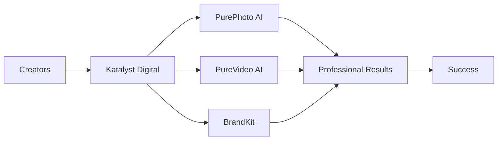

# 🚀 Katalyst Digital

  

### Powering the creators of tomorrow

Building next-generation AI platforms for photo editing, video production, and brand creation.

---

## 🎯 Our Mission

We're on a mission to **democratize creative AI technology**, making professional-grade tools accessible to creators, businesses, and startups worldwide.

## 🛠️ Our Products

<table>
<tr>
<td width="33%" align="center">

### 📸 PurePhoto AI
**Professional Photo Editing**

Transform your images with AI-powered editing tools designed for creators and professionals.

🎨 Advanced AI filters  
🖼️ Intelligent background removal  
✨ One-click enhancements  
🎭 Style transfer & effects

</td>
<td width="33%" align="center">

### 🎥 PureVideo AI
**Video Production Studio**

Create stunning videos with AI-assisted editing, effects, and production tools.

🎬 AI video editing  
🎞️ Smart scene detection  
🎵 Audio enhancement  
📊 Automated workflows

</td>
<td width="33%" align="center">

### 🎯 Katalyst BrandKit
**Complete Brand Creation**

Build your entire brand identity with AI-powered design and management tools.

🎨 Logo generation  
📝 Brand guidelines  
🎨 Color palettes  
📐 Design templates

</td>
</tr>
</table>

---

## 🌟 Why Katalyst Digital?

- 🚀 **Innovation First** - Cutting-edge AI technology
- 🎨 **Creator-Focused** - Built by creators, for creators
- 💡 **Easy to Use** - Professional results without the learning curve
- 🌐 **Accessible** - Powerful tools at affordable prices
- 🤝 **Open Ecosystem** - Developer-friendly APIs and integrations

---

## 📊 Tech Stack

---

## 📈 Roadmap

### 2025 Q4
- [x] Brand identity and website launch
- [x] Social media presence established
- [x] Waitlist platform live
- [ ] Alpha testing program

### 2026 Q1
- [ ] 🚀 **PurePhoto AI Beta Launch**
- [ ] Early access program
- [ ] API documentation release
- [ ] Developer community launch

### 2026 Q2
- [ ] 🎥 **PureVideo AI Beta Launch**
- [ ] Integration marketplace
- [ ] Mobile app development
- [ ] Partnership program

### 2026 Q3
- [ ] 🎯 **BrandKit Beta Launch**
- [ ] Enterprise tier release
- [ ] Public API launch
- [ ] Open-source components

---

## 🤝 Get Involved

We're building in public and would love your input!

### For Creators
- 📝 [Join the Waitlist](https://www.katalystdl.ai/waitlist.html) - Be first to access our tools
- 💬 [Share Feedback](https://www.katalystdl.ai/contact.html) - Help shape our products
- 🌟 Follow our journey on [LinkedIn](https://www.linkedin.com/company/katalyst-digital-inc) & [Twitter](https://x.com/KatalystDl)

### For Developers
- 🔧 **Coming Soon:** Developer API access
- 📚 **Coming Soon:** Technical documentation
- 🤝 **Coming Soon:** Contribution guidelines
- 💡 **Coming Soon:** Open-source projects

### For Partners
- 🤝 [Partnership Inquiries](https://www.katalystdl.ai/contact.html)
- 📧 Email: info@katalystdl.ai

---

## 📫 Contact Us

**Website:** [katalystdl.ai](https://www.katalystdl.ai)  
**Email:** info@katalystdl.ai  
**Location:** Orlando, FL

**Connect with us:**  
[LinkedIn](https://www.linkedin.com/company/katalyst-digital-inc) • 
[Twitter/X](https://x.com/KatalystDl) • 
[GitHub](https://github.com/Katalyst-Digital)

---

## 📄 License

Projects will be released under appropriate open-source licenses. Check individual repositories for specific licensing information.

---

### 🌟 Star our repositories to stay updated!

**Made with ❤️ by the Katalyst Digital team**

*Powering the creators of tomorrow* 🚀

---

## 📊 Organization Stats

<!--START_SECTION:github-stats-->
<!--END_SECTION:github-stats-->

> **Note:** This organization is preparing for our 2026 launch. Repositories will be made public as we progress through our development roadmap. Stay tuned! 🚀
